# Helix Authentication Troubleshooting Checklist

> Source: [Helix xWiki](https://wiki.helixops.ai/xwiki/bin/view/Personal-Spaces/mwalters/Helix-Content/Helix-Authentication-Troubleshooting-Checklist/)

## Pod Health

Check that all pods are running and healthy:

- Helix IS namespace — platform pods
- Helix Platform namespace — RSSO and Postgres

## RSSO Checks

Login to RSSO as the admin user — default **admin/RSSO#Admin#**.

Click on the pin icon for the SAAS_TENANT and confirm that **Tenant: SAAS_TENANT** is displayed in the page header.

Note the name of the non-SAAS_TENANT — for example **red.60831950** in the example below.

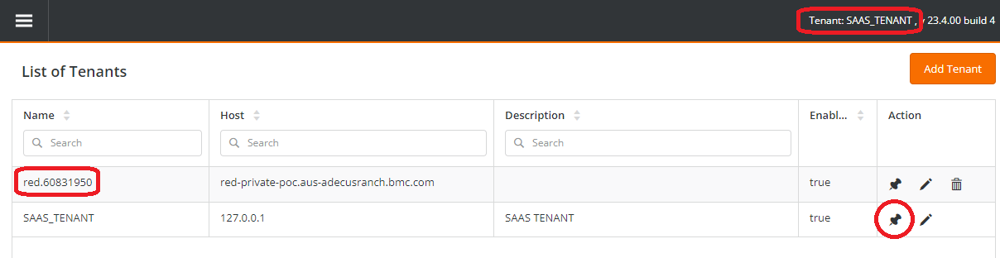

Go to the **Realm** tab.

Confirm that a realm exists with the name format **CUSTOMER_SERVICE-ENVIRONMENT**, where these values come from the **HELIX_ONPREM_DEPLOYMENT** pipeline. In the example, CUSTOMER_SERVICE is **seal-red** and ENVIRONMENT is **itsm**, so the realm is called **seal-red-itsm**.

> **Note:** If the customer uses **prod** as the ENVIRONMENT value, the realm name must still include it even though the hostnames in the realm will not.

Confirm that the **Tenant** for the realm is the same as the **Tenant Name** above.

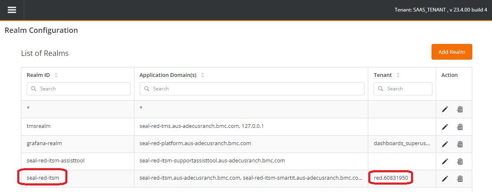

Edit the realm by clicking the pencil icon and verify that all expected hostnames are listed in **Application Domain(s)**.

Confirm there are no leading or trailing spaces around the **Tenant** value.

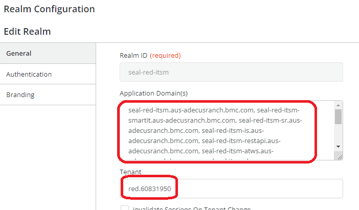

Click the **Authentication** tab and verify that an entry exists for **AR** type authentication. Edit the entry.

The **Host** should be **platform-user-ext.HELIX-IS-NAMESPACE** and the port **46262**.

Validate using the **Test** button.

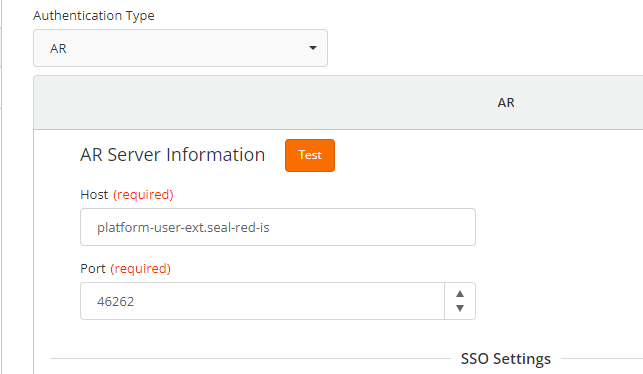

Test connectivity to RSSO from the Deployment Engine command line — replace **LB_HOST** with the customer value:

```bash
curl -k -X POST https://LB_HOST/rsso/api/v1.1/admin/login \
  -H 'Content-Type: application/json' \
  -d '{"username":"admin","password":"RSSO#Admin#"}'
```

Test that the **custom_cacert.pem** file is valid:

```bash
curl -X POST https://LB_HOST/rsso/api/v1.1/admin/login \
  --cacert /path/to/custom_cacert.pem \
  -H 'Content-Type: application/json' \
  -d '{"username":"admin","password":"RSSO#Admin#"}'
```

## Jenkins HELIX_ONPREM_DEPLOYMENT Pipeline Checks

Check the RSSO_PARAMETERS section of the pipeline run that was used to deploy IS.

- Make sure that the **/rsso** component is at the end of the RSSO_URL
- Correct credentials?
- The TENANT_DOMAIN should be the tenant name as shown in RSSO above

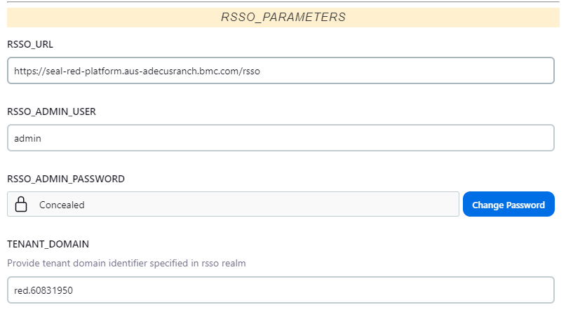

## Helix IS Platform Pod

Get a command prompt in the Helix IS platform pod and check **/opt/bmc/ARSystem/db/arjavaplugin-authentication.log** and **/tmp/rsso.0.log** for errors.

Test connectivity to RSSO — expected to return an access token:

```bash
curl -k -X POST $RSSO_SERVICE_URL/api/v1.1/admin/login \
  -H 'Content-Type: application/json' \
  -d '{"username":"admin","password":"RSSO#Admin#"}'
```

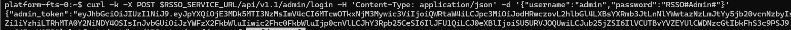

Check the RSSO tenant/agent values:

```bash
cat /opt/bmc/ARSystem/conf/rsso.cfg
cat /opt/bmc/ARSystem/conf/rsso-agent.properties | grep sso-
```

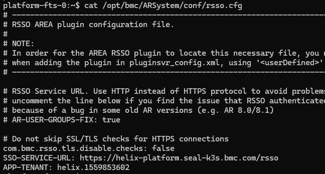

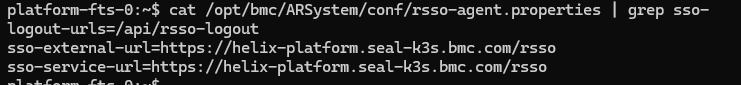

## Certificate Issues

### From Helix IS platform pod

Check that the Java **cacerts** in the IS platform pod has the customer's certificate — replace **XXX** with the alias name used when adding the certificate to the BMC-provided **cacerts** file.

```bash
/opt/java/bin/keytool --list -cacerts -storepass changeit -alias XXX
```

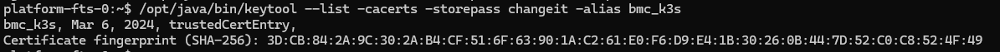

### From Deployment Engine

View certs from LB/ingress controller:

```bash
openssl s_client -showcerts -connect LB_HOST:443
```

This example is a wildcard certificate for **\*.seal-k3s.bmc.com**, so it is valid for any host with that domain. See below for one using **Subject Alternate Names (SANs)**.

Look at the **issuer information** — the customer will need a valid certificate chain for this and any higher-level CAs.

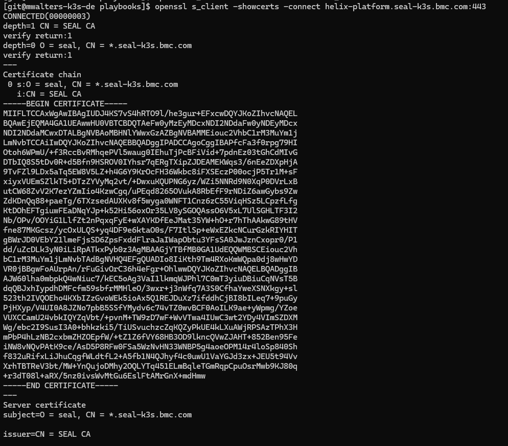

Certificate using **SANs**:

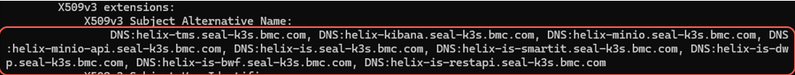

Download and compile SSLPoke.java to test for a valid certificate in the **cacerts** file:

```bash
curl -s https://gist.githubusercontent.com/MatthewJDavis/50f3f92660af72c812e21b7ff6b56354/raw/7f258a30be4ddea7b67239b40ae305f6a2e98e0a/SSLPoke.java -o SSLPoke.java
javac SSLPoke.java
java -Djavax.net.ssl.trustStore=/path/to/cacerts SSLPoke LB_HOST 443
```

If the **cacerts** file does not include the required certificates you will see errors such as "unable to find valid certification path to requested target".

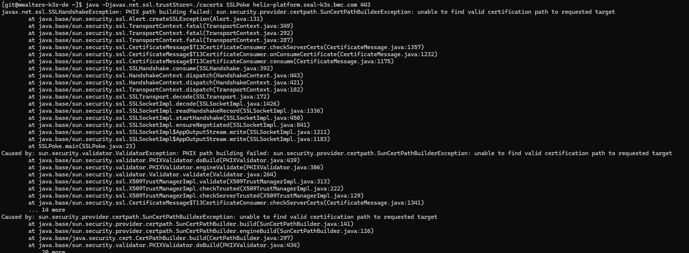

## Certificate Chain Tests

You can see if you have the full certificate chain and view certificate file details using [https://tools.keycdn.com/ssl](https://tools.keycdn.com/ssl).

Grab the data from the customer's PEM file, or use the **BEGIN .. / .. END** block from the **openssl** command above.

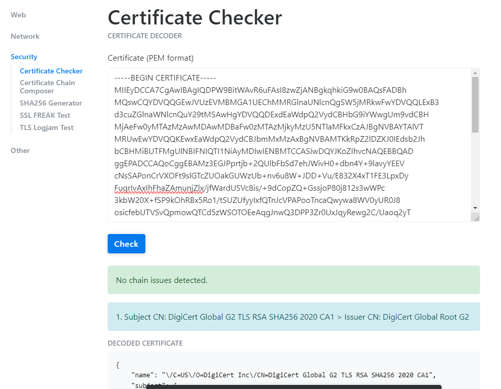

This helps you see which CA issued the certificate and whether you need intermediate certificates.

## Recreate Helix IS cacerts Secret

If you have a valid **cacerts** file and need to update the one that is deployed:

> **Warning:** The cacerts file must be called **cacerts** — not names such as mycacerts or newcacerts — because the filename is stored in the secret and referenced by name. A restart of pods that use the secret may be required for new values to be picked up.

```bash
kubectl delete secret cacerts -n HELIX-IS-NAMESPACE
kubectl create secret -n HELIX-IS-NAMESPACE generic cacerts \
  --from-file=cacerts --dry-run=client -o yaml | kubectl apply -f -
```
